# Installing a Hadoop cluster with Cloudera Manager

## Assumptions

* instances for each node type are up and accessible (ssh)
* a supported OS is installed on each instance
* a DNS server is available on the network and hostnames are resolvable
* instances are on the same private network
* all commands will be run as root user unless specified otherwise

If you are missing anything then maybe check the [Cloud Setup documentation](CloudSetup.md).

## Official installation paths

* [Path A: One-stop binary installer](http://www.cloudera.com/content/cloudera/en/documentation/core/latest/topics/cm_ig_install_path_a.html)
    * Useful for short-term, throwaway projects
    * Relies on embedded, hard-configured PostgreSQL server
* [Path B: Install CM and database manually](http://www.cloudera.com/content/cloudera/en/documentation/core/latest/topics/cm_ig_install_path_b.html)
    * Any cluster standing for more than 3-6 months
    * Can use Oracle, MySQL, MariaDB, or PostgreSQL server
    * Can deploy CDH as Linux packages or [parcels](http://www.cloudera.com/documentation/enterprise/latest/topics/cm_ig_parcels.html)
* [Path C: Tarballs](http://www.cloudera.com/content/cloudera/en/documentation/core/latest/topics/cm_ig_install_path_c.html)
    * DIY-oriented
    * Useful with other deployment tools (Chef, Puppet)

> This workshop follows path B.

## Preinstall

### Package updates and some handy tools

1. Update the nodes and add some missing tools [all nodes]

```
yum clean all
yum -y update
yum install -y wget vim mlocate net-tools nc lsof bind-utils nscd ntp
```

### Mounting additional disks

To get the most out of your cluster, having enough disks is very important. In production you want disks with heavy I/O requirements to be dedicated to whatever their main usage is.

**HDFS Data disks**
* mount with noatime option
* reduce the number of reserved blocks
* create /mnt/data on master nodes as well
* a good ratio is to have the same amount of disks as CPU cores
* noatime disables writing access timestamps to disk

workshop example for single worker node:
```
mkfs.ext4 -m 0 -F /dev/disk/by-id/scsi-0DO_Volume_data0
tune2fs -m 0 /dev/disk/by-id/scsi-0DO_Volume_data0
sudo mkdir -p /mnt/data; sudo mount -o discard,defaults,noatime /dev/disk/by-id/scsi-0DO_Volume_data0 /mnt/data; echo /dev/disk/by-id/scsi-0DO_Volume_data0 /mnt/data ext4 defaults,nofail,discard,noatime 0 0 | sudo tee -a /etc/fstab

mkfs.ext4 -m 0 -F /dev/disk/by-id/scsi-0DO_Volume_data1
tune2fs -m 0 /dev/disk/by-id/scsi-0DO_Volume_data1
sudo mkdir -p /mnt/data; sudo mount -o discard,defaults,noatime /dev/disk/by-id/scsi-0DO_Volume_data1 /mnt/data; echo /dev/disk/by-id/scsi-0DO_Volume_data1 /mnt/data ext4 defaults,nofail,discard,noatime 0 0 | sudo tee -a /etc/fstab

mkfs.ext4 -m 0 -F /dev/disk/by-id/scsi-0DO_Volume_data2
tune2fs -m 0 /dev/disk/by-id/scsi-0DO_Volume_data2
sudo mkdir -p /mnt/data; sudo mount -o discard,defaults,noatime /dev/disk/by-id/scsi-0DO_Volume_data2 /mnt/data; echo /dev/disk/by-id/scsi-0DO_Volume_data2 /mnt/data ext4 defaults,nofail,discard,noatime 0 0 | sudo tee -a /etc/fstab
```

**Zookeeper disks**
* choose disks with higher I/O throughput

workshop example for a single master node:
```
mkfs.ext4 -m 0 -F /dev/disk/by-id/scsi-0DO_Volume_zoo0
tune2fs -m 0 /dev/disk/by-id/scsi-0DO_Volume_zoo0
sudo mkdir -p /mnt/zoo; sudo mkdir -p /mnt/data; sudo mount -o discard,defaults /dev/disk/by-id/scsi-0DO_Volume_zoo0 /mnt/zoo; echo /dev/disk/by-id/scsi-0DO_Volume_zoo0 /mnt/zoo ext4 defaults,nofail,discard 0 0 | sudo tee -a /etc/fstab

mkfs.ext4 -m 0 -F /dev/disk/by-id/scsi-0DO_Volume_zoo1
tune2fs -m 0 /dev/disk/by-id/scsi-0DO_Volume_zoo1
sudo mkdir -p /mnt/zoo; sudo mkdir -p /mnt/data; sudo mount -o discard,defaults /dev/disk/by-id/scsi-0DO_Volume_zoo1 /mnt/zoo; echo /dev/disk/by-id/scsi-0DO_Volume_zoo1 /mnt/zoo ext4 defaults,nofail,discard 0 0 | sudo tee -a /etc/fstab

mkfs.ext4 -m 0 -F /dev/disk/by-id/scsi-0DO_Volume_zoo2
tune2fs -m 0 /dev/disk/by-id/scsi-0DO_Volume_zoo2
sudo mkdir -p /mnt/zoo; sudo mkdir -p /mnt/data; sudo mount -o discard,defaults /dev/disk/by-id/scsi-0DO_Volume_zoo2 /mnt/zoo; echo /dev/disk/by-id/scsi-0DO_Volume_zoo2 /mnt/zoo ext4 defaults,nofail,discard 0 0 | sudo tee -a /etc/fstab
```

> The examples above are specific for digitalocean instances. The steps do not cover tasks like making disks available to the server.

### ssh key for passwordless access created

Cloudera manager requires access to the required servers. Though it offers a password option, we strongly recommended to use the key based access. This means that you need to make sure that access with one public key is enabled to all servers in the cluster. We've simplified this part by creating a script, which we run from desktop.

```
bash scripts/dist_ssh_keys.sh
```

### important system configuration settings and checks

1. vm.swapiness settings on to 1 [all nodes]

```
sysctl vm.swappiness=1
echo "vm.swappiness = 1" >> /etc/sysctl.conf
```

> Traditionally the vm.swapiness was recommended to be set to 0, but now the recommended value is 1. Check [this blog post](http://blog.cloudera.com/blog/2015/01/how-to-deploy-apache-hadoop-clusters-like-a-boss/)

2. transparent hugepages

```
echo 'never' > /sys/kernel/mm/transparent_hugepage/defrag
echo 'never' > /sys/kernel/mm/transparent_hugepage/enabled
cat /sys/kernel/mm/transparent_hugepage/defrag
cat /sys/kernel/mm/transparent_hugepage/enabled
cat >> /etc/rc.local <<EOF
echo 'never' > /sys/kernel/mm/transparent_hugepage/defrag
echo 'never' > /sys/kernel/mm/transparent_hugepage/enabled
EOF
```

> THP don't go well with Hadoop workloads and could cause degrade in performance.

3. forward and reverse host lookup

First and foremost check that /etc/hosts doesn't have any entries pointing to the hostname!

  * forward lookup

    ```
    host `hostname`
    getent hosts <FQDN>
    nslookup <FQDN>
    ```
  * reverse lookup

    ```
    getent hosts <IP>
    nslookup <IP>
    ```
  * cloudera check

    ```
    python -c 'import socket; print socket.getfqdn(), socket.gethostbyname(socket.getfqdn())'
    ```

4. correct NTP settings

Make sure you enable NTP on all of your hosts.

5. IPTables

For the workshop we will not setup any rules in IP tables. Though it is possible to return and setup IP tables at a later stage. Cloudera Manager has a section where all configured ports are visible and this can be used for IPTables setup.

6. SELinux

We suggest to disable SELinux on all boxes.

to check:
```
getenforce
```

### database

This workshop covers a quick installation and configuration of mariadb.

1. Install the yum repo [all nodes]
```
cat > /etc/yum.repos.d/mariadb.repo <<'EOF'
# MariaDB 10.1 CentOS repository list - created 2017-01-03 13:50 UTC
# http://downloads.mariadb.org/mariadb/repositories/
[mariadb]
name = MariaDB
baseurl = http://yum.mariadb.org/10.1/centos7-amd64
gpgkey=https://yum.mariadb.org/RPM-GPG-KEY-MariaDB
gpgcheck=1
EOF
```

2. install mariadb-server from yum [edge node]
```
yum -y install mariadb-server
```

3. stop the mariadb-server if running [edge node]
```
service mariadb stop
```

4. Add the recommended configuration [edge node]
```
cat > /etc/my.cnf <<'EOF'
[mysqld]
transaction-isolation = READ-COMMITTED
# Disabling symbolic-links is recommended to prevent assorted security risks;
# to do so, uncomment this line:
# symbolic-links = 0

key_buffer = 16M
key_buffer_size = 32M
max_allowed_packet = 32M
thread_stack = 256K
thread_cache_size = 64
query_cache_limit = 8M
query_cache_size = 64M
query_cache_type = 1

max_connections = 550
#expire_logs_days = 10
#max_binlog_size = 100M

#log_bin should be on a disk with enough free space. Replace '/var/lib/mysql/mysql_binary_log' with an appropriate path for your system
#and chown the specified folder to the mysql user.
log_bin=/var/lib/mysql/mysql_binary_log

binlog_format = mixed

read_buffer_size = 2M
read_rnd_buffer_size = 16M
sort_buffer_size = 8M
join_buffer_size = 8M

# InnoDB settings
innodb_file_per_table = 1
innodb_flush_log_at_trx_commit  = 2
innodb_log_buffer_size = 64M
innodb_buffer_pool_size = 4G
innodb_thread_concurrency = 8
innodb_flush_method = O_DIRECT
innodb_log_file_size = 512M

[mysqld_safe]
log-error=/var/log/mariadb/mariadb.log
pid-file=/var/run/mariadb/mariadb.pid
EOF
```

> check https://www.cloudera.com/documentation/enterprise/latest/topics/install_cm_mariadb.html#install_cm_mariadb_config for details.

5. enable and start MariaDB [edge node]
```
systemctl enable mariadb
systemctl start mariadb
```

6. Next we'll set the root password and some basic security requirements [edge node]
```
$ sudo /usr/bin/mysql_secure_installation
[...]
Enter current password for root (enter for none):
OK, successfully used password, moving on...
[...]
Set root password? [Y/n] y
New password:
Re-enter new password:
Remove anonymous users? [Y/n] Y
[...]
Disallow root login remotely? [Y/n] N
[...]
Remove test database and access to it [Y/n] Y
[...]
Reload privilege tables now? [Y/n] Y
All done!
```

7. install the JDBC driver [all nodes]
```
wget https://dev.mysql.com/get/Downloads/Connector-J/mysql-connector-java-5.1.41.tar.gz
tar -xvzf mysql-connector-java-5.1.41.tar.gz
mkdir -p /usr/share/java/
cp mysql-connector-java-5.1.41/mysql-connector-java-5.1.41-bin.jar /usr/share/java/mysql-connector-java.jar
```

8. install the clients [master and worker nodes]

> check that each node has the MariaDB repo. If not run step 1 again.

```
yum install -y MariaDB-client
```

9. enable access for Cloudera specific accounts [edge node]
```
mysql -u root -p
Enter password: <enter password>

create database amon DEFAULT CHARACTER SET utf8;
create database rman DEFAULT CHARACTER SET utf8;
create database metastore DEFAULT CHARACTER SET utf8;
create database sentry DEFAULT CHARACTER SET utf8;
create database nav DEFAULT CHARACTER SET utf8;
create database navms DEFAULT CHARACTER SET utf8;
create database scm DEFAULT CHARACTER SET utf8;
create database hue DEFAULT CHARACTER SET utf8;
create database oozie DEFAULT CHARACTER SET utf8;
grant all on amon.* TO 'amon'@'%' IDENTIFIED BY 'amon';
grant all on rman.* TO 'rman'@'%' IDENTIFIED BY 'rman';
grant all on metastore.* TO 'hive'@'%' IDENTIFIED BY 'hive';
grant all on sentry.* TO 'sentry'@'%' IDENTIFIED BY 'sentry';
grant all on nav.* TO 'nav'@'%' IDENTIFIED BY 'nav';
grant all on navms.* TO 'navms'@'%' IDENTIFIED BY 'navms';
grant all on scm.* TO 'scm'@'%' IDENTIFIED BY 'scm';
grant all on hue.* to 'hue'@'%' identified by 'hue';
grant all on hue.* to 'hue'@'localhost' identified by 'hue';
grant all privileges on oozie.* to 'oozie'@'localhost' identified by 'oozie';
grant all privileges on oozie.* to 'oozie'@'%' identified by 'oozie';
exit;
```

> Simple passwords are setup to easy the flow of this workshop. In production consider stronger passwords.

## Install Cloudera Manager

1. Add the Cloudera repo [all nodes]
```
cat > /etc/yum.repos.d/Cloudera.repo <<'EOF'
[cloudera-manager]
# Packages for Cloudera Manager, Version 5, on RedHat or CentOS 5 x86_64
name=Cloudera Manager
baseurl=https://archive.cloudera.com/cm5/redhat/7/x86_64/cm/5/
gpgkey =https://archive.cloudera.com/cm5/redhat/7/x86_64/cm/RPM-GPG-KEY-cloudera
gpgcheck = 1
EOF
```
> Always double check the baseurl details so that you are looking at the right repository

2. Install a supported oracle jdk [edge node]
```
yum -y install oracle-j2sdk1.7
```

3. Install Cloudera Manager Server [edge node]
```
yum -y install cloudera-manager-daemons cloudera-manager-server
```

> Do not start the server right now !!!

4. import the database schema <mark style="background-color: grey; padding:0;">[edge nodes]</mark>
> The steps are a bit hard to find in the Cloudera documentation, but here is the [link](http://www.cloudera.com/documentation/enterprise/latest/topics/cm_ig_installing_configuring_dbs.html#concept_i2r_m3m_hn)

  * Run the scm_prepare_database.sh script
  ```
  /usr/share/cmf/schema/scm_prepare_database.sh mysql scm scm scm
  ```

5. Start Cloudera Manager Server
    ```
    service cloudera-scm-server start
    ```
    > Its a good idea to watch what is happing in the logs in `/var/log/cloudera-scm-server/cloudera-scm-server.log`
    > This is the magical line you are looking for: `WebServerImpl:com.cloudera.server.cmf.WebServerImpl: Started Jetty server.`

6. Open a browser and login to Cloudera Manager as admin with password admin

http://<edge_node>:7180

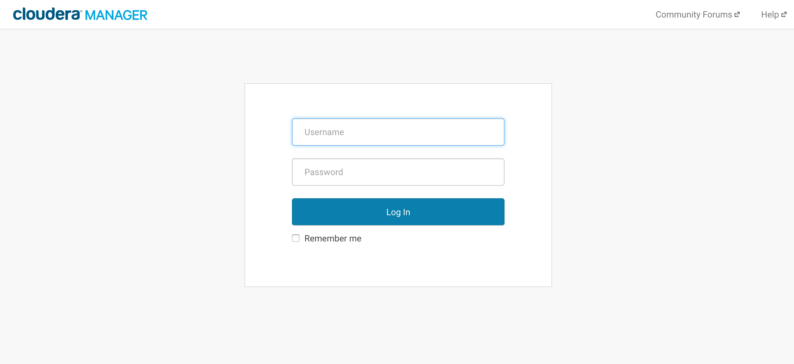

7. Run the instructions in the wizard
  a. Read and accept the end user license agreement.
  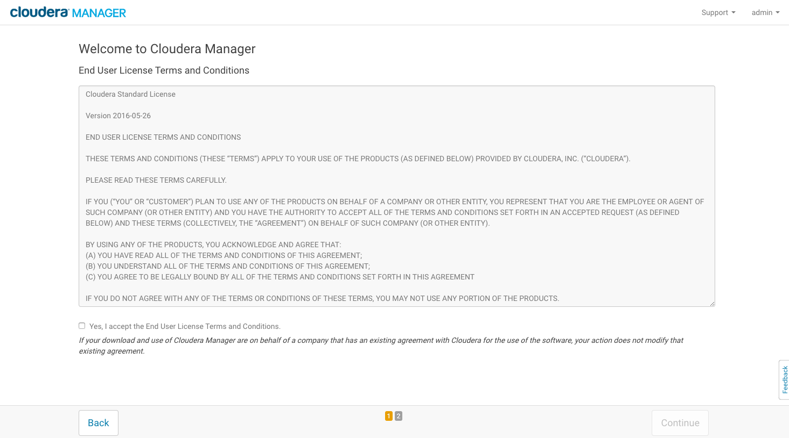

  b. Choose a Cloudera Manager edition (we will use Enterprise Data Hub trial). Press Continue.
  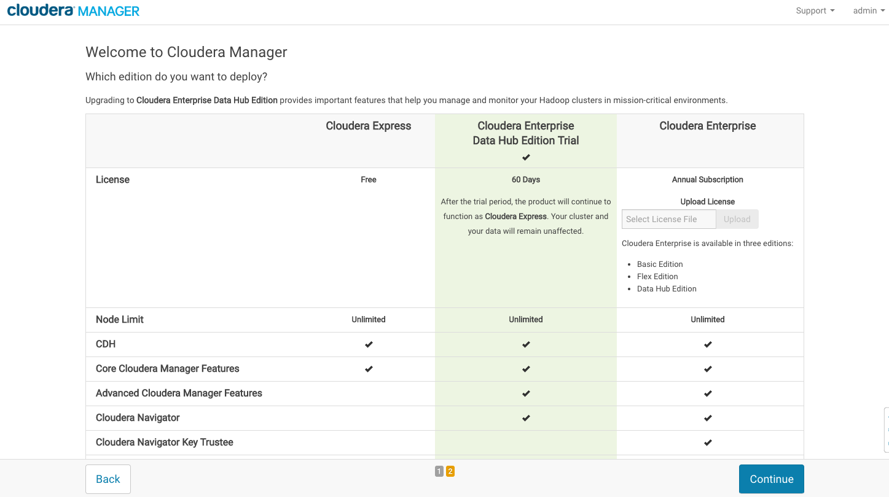

  c. Check the installer version shown in the info page. Press Continue.
  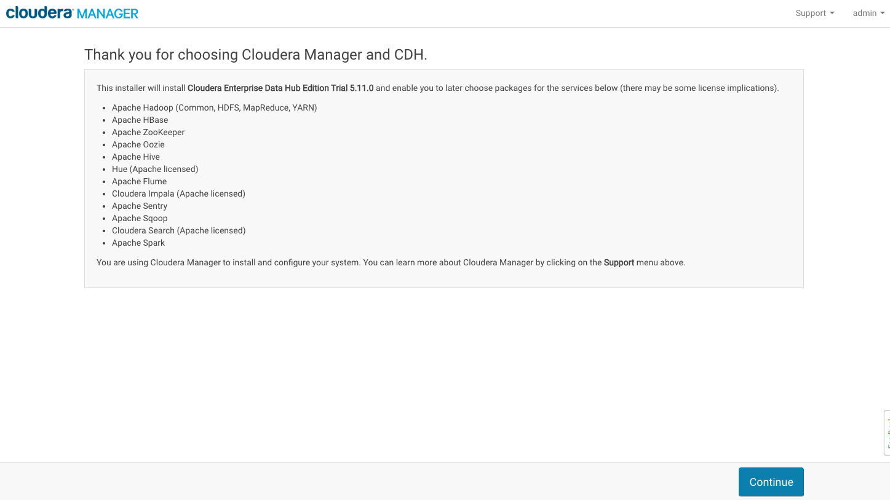

  d. Specify all hostnames and press search.
  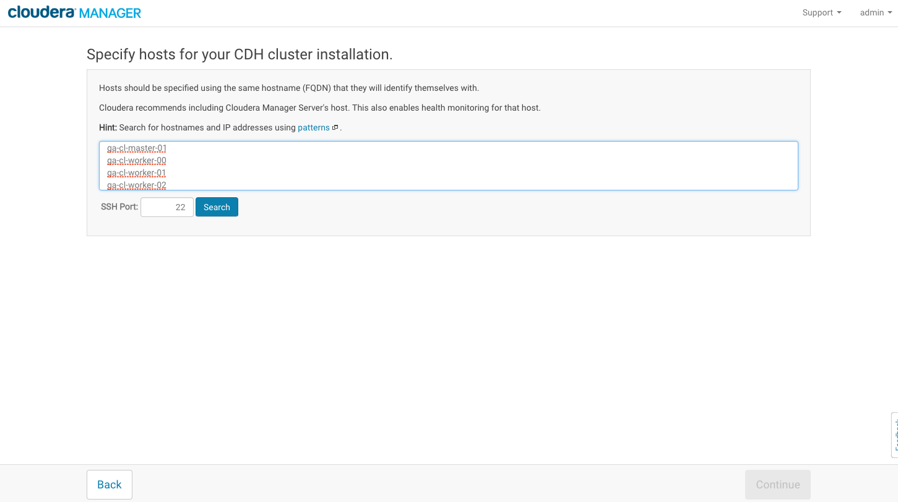

  e. Verify that server FQDN's are correct, IP's are correct and all hosts are in ready state. If ok press Continue.
  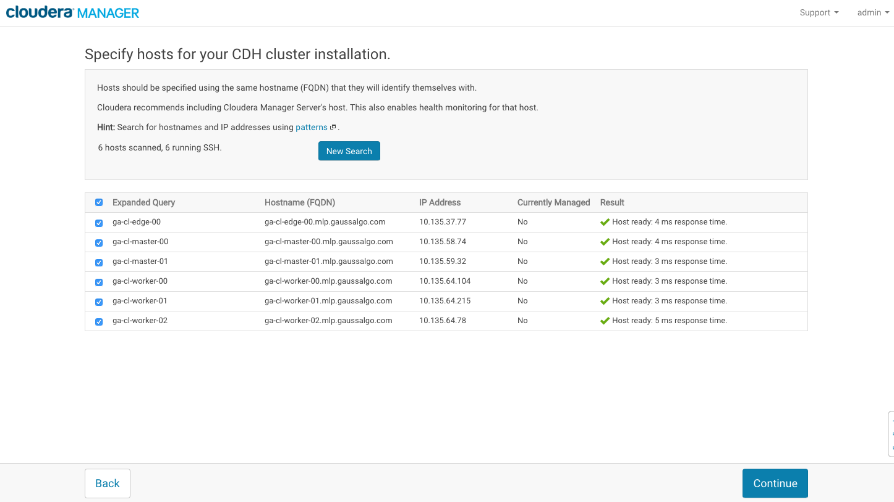
  
  f. Choose desired repositories and installation options. (We will leave it as it is for now).
  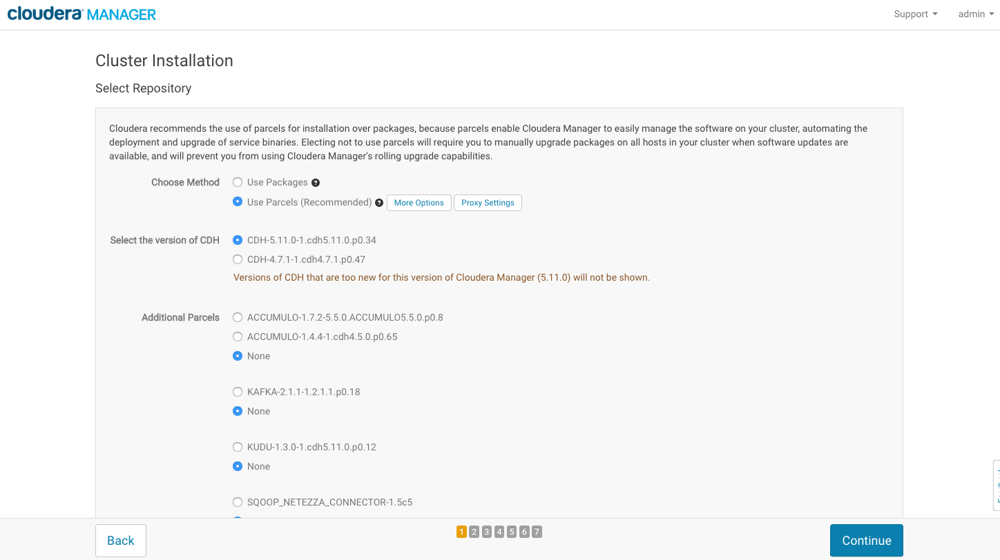

  g. JDK installation selection. For the workshop tick both boxes.
  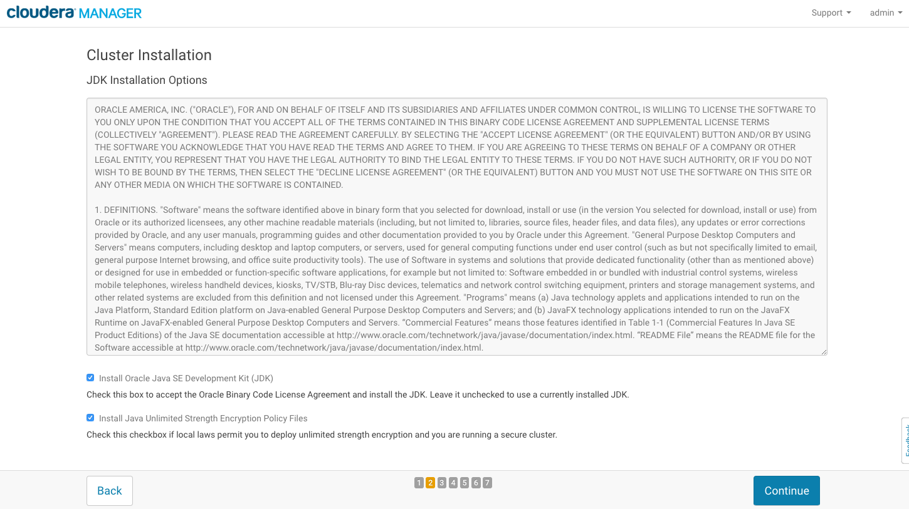

  h. DO NOT select single user mode.
  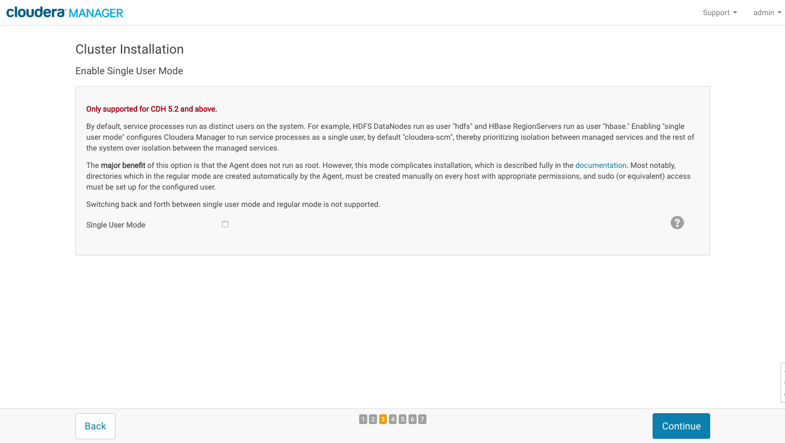

  i. Add the ssh private key you use for root. (Download the key from the server if not done)
  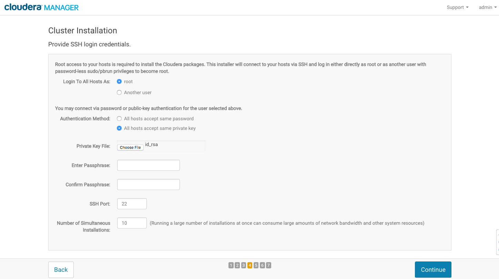

  j. Run the installation and check progress. All servers must have successful completion. Press Continue once done.
  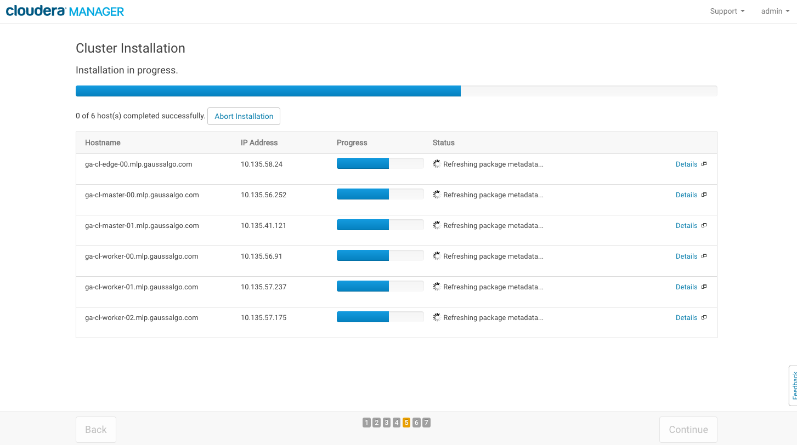
  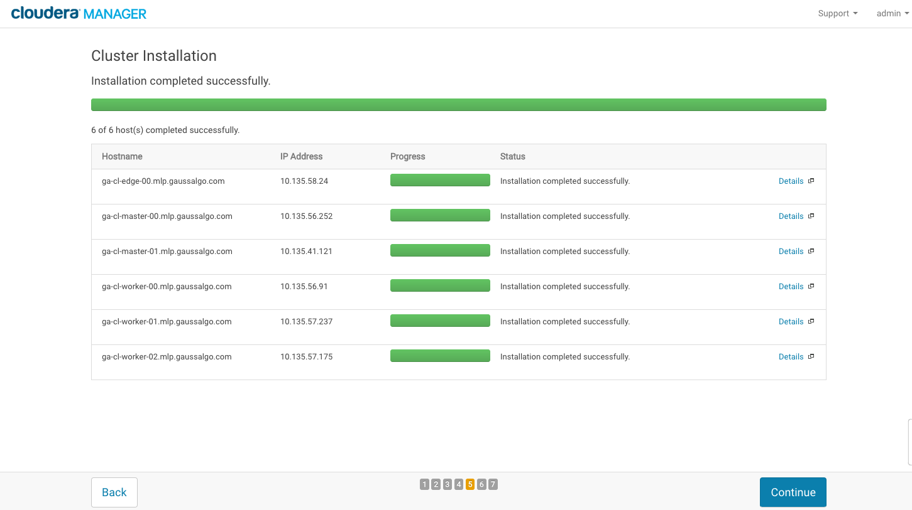

  k. Let the parcels install. Press Continue.
  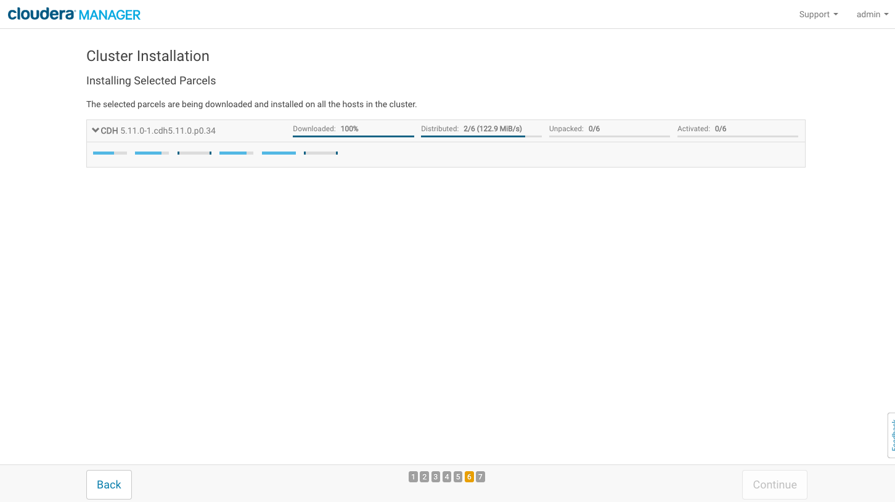

  l. In the cluster setup page choose the desired services. In the workshop we'll run core Hadoop.
  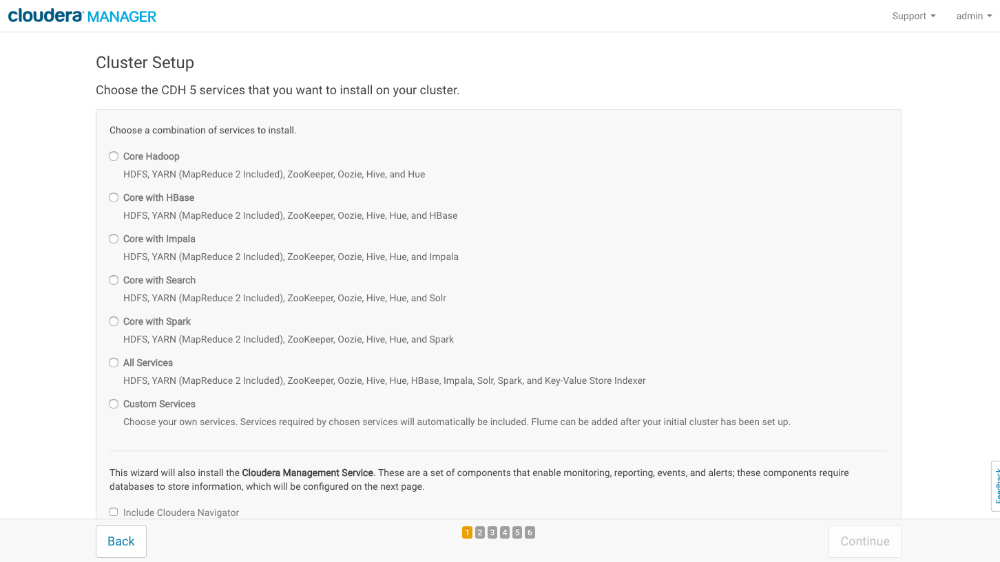

  m. Next we need to define the roles to the servers.
  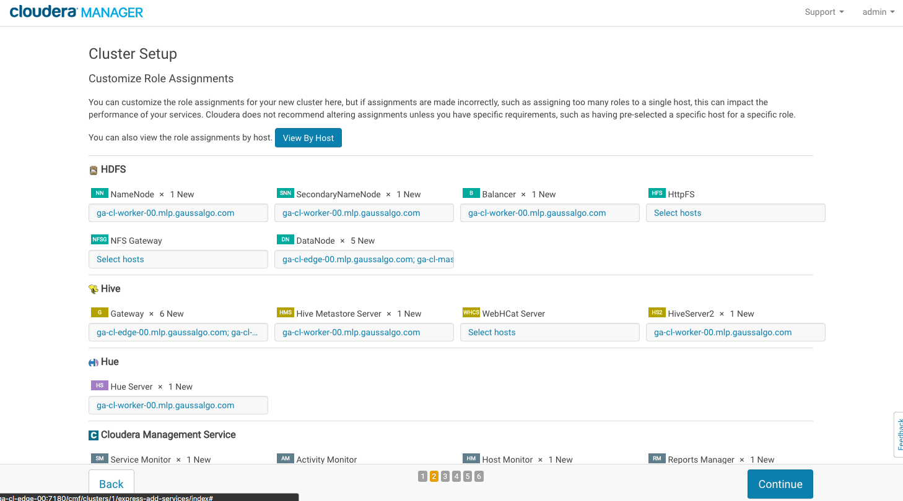

  n. Click on the view by host.
  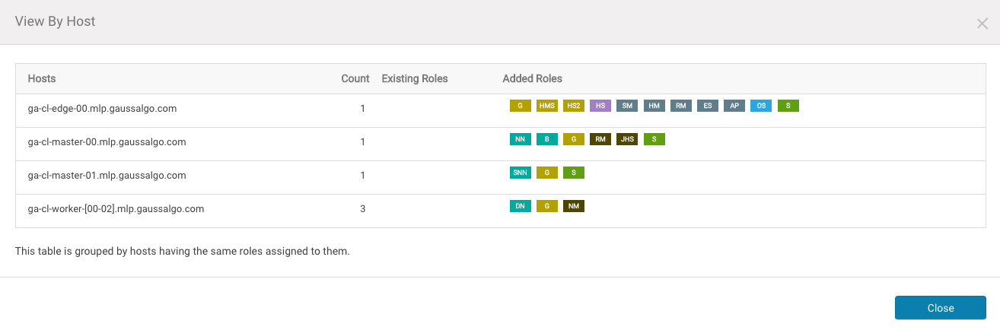

  o. In database setup enter credentials for the individual mariaDB databases.
  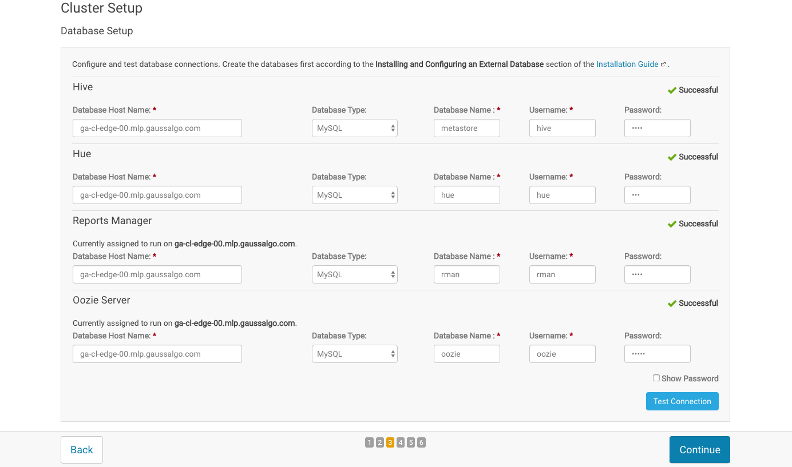

  p. Next step looks at the most important configuration.

  Make sure that for the workshop you have the following settings.

    * `dfs.block.size, dfs.blocksize` = 128MiB

    * `dfs.datanode.failed.volumes.tolerated` = 0

    * `dfs.data.dir, dfs.datanode.data.dir` = /mnt/data/dfs/dn

    * `dfs.name.dir, dfs.namenode.name.dir` = /mnt/data/dfs/nn

    * `fs.checkpoint.dir, dfs.namenode.checkpoint.dir` = /mnt/data/dfs/snn

    * `hive.metastore.warehouse.dir` = /user/hive/warehouse

    * `hive.metastore.port` = 9083

    * `yarn.nodemanager.local-dirs` = /mnt/data/yarn/nm

    * `dataDir` = /mnt/zoo/zookeeper

    * `dataLogDir` = /mnt/zoo/zookeeper

  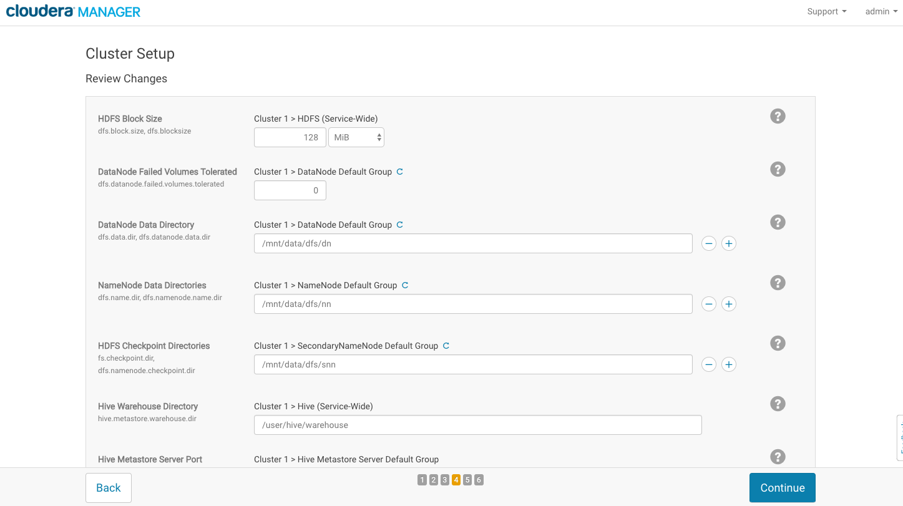

  q. Run and complete the cluster setup.
  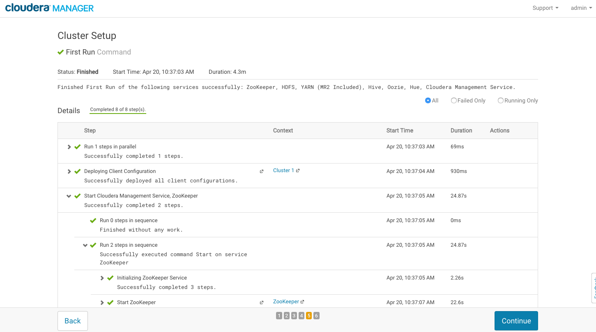

  r. Press Finish.

8. Restart the cluster if required

9. Setup HA
  a. while logged into Cloudera Manager click on the HDFS service in Cluster 1
  b. click on **Actions** button and then navigate to **Enable High Availability**
  c. confirm the new nameservice
  d. select a second namenode and 3 journal nodes
  e. enter directory locations for namenode data (/mnt/data/dfs/nn) and journal node edits (/mnt/data/dfs/jn)
  f. leave checkboxes as they are at the end of the screen
  g. run the HA migration and wait until complete
  h. check the new role instances in HDFS -> Instances section of Cloudera Manager


10. Install Spark2.1

  a. Download the Spark 2 CSD
  ```
  wget http://archive.cloudera.com/spark2/csd/SPARK2_ON_YARN-2.1.0.cloudera1.jar
  ```

  b. move the jar to the csd directory
  ```
  mv SPARK2_ON_YARN-2.1.0.cloudera1.jar /opt/cloudera/csd
  ```

  c. change permissions and ownership
  ```
  chown cloudera-scm:cloudera-scm /opt/cloudera/csd/SPARK2_ON_YARN-2.1.0.cloudera1.jar
  chmod 644 /opt/cloudera/csd/SPARK2_ON_YARN-2.1.0.cloudera1.jar
  ```

  d. restart Cloudera Manager
  ```
  service cloudera-scm-server restart
  ```

  e. log back into Cloudera Manager and click on the "Stale Configuration" icon
  
  f. click Restart Cloudera Management Service
  
  g. click the parcels icon
  
  h. Find SPARK2 in the list and click Download
  
  i. Next click on Distribute
  
  j. Finally click on Activate
  
  k. Go back to the main screen
  
  l. Next to Cluster 1 click on the dropdown and select "Add Service"
  
  m. Select Spark 2
  
  n. Choose the dependency with Hive, HDFS, YARN, Zookeeper
  
  o. Add the Spark History Server role to one of the master nodes.
  
  p. Select all hosts as gateway roles for Spark
  
  q. Press Continue and wait until successfully completed
  
  r. Refresh any "Stale Configuration"

11. Install Jupyter

  a. install developement tools for CentOS 7 (gcc,make,...)
  ```
  yum groupinstall "Development Tools"
  ```

  b. install python-devel
  ```
  yum install python-devel
  ```

  c. install pip
  ```
  curl "https://bootstrap.pypa.io/get-pip.py" -o "get-pip.py"
  python get-pip.py
  ```

  d. install Jupyter
  ```
  pip install jupyter
  ```

  e. run with pyspark
  ```
  export PYSPARK_DRIVER_PYTHON=jupyter
  export PYSPARK_DRIVER_PYTHON_OPTS="notebook --no-browser --ip=0.0.0.0 --allow-root"
  pyspark2
  ```

## Further reading

[Blog: How to deploy Apache Hadoop clusters like a boss](http://blog.cloudera.com/blog/2015/01/how-to-deploy-apache-hadoop-clusters-like-a-boss/)
[Cloudera Security Overview](https://www.cloudera.com/documentation/enterprise/5-9-x/topics/sg_edh_overview.html)
[Enabling Kerberos Authentication Using the Wizard](https://www.cloudera.com/documentation/enterprise/latest/topics/cm_sg_intro_kerb.html)
